# T2I Grader Metrics System - Technical Documentation

> **Document Created:** January 27, 2026  
> **Project:** webapp/gradio-demo (Text-to-Image Grader)  
> **Author:** Technical Documentation System

---

## Source Files Referenced

| File Path | Insights Gained |
|-----------|-----------------|
| [webapp/gradio-demo/src/metrics/__init__.py](../webapp/gradio-demo/src/metrics/__init__.py) | Module structure, exported functions, metric hierarchy (North Star → Supporting) |
| [webapp/gradio-demo/src/metrics/soft_tifa.py](../webapp/gradio-demo/src/metrics/soft_tifa.py) | North Star metric implementation: atomic fact extraction, batch/parallel verification, geometric mean calculation |
| [webapp/gradio-demo/src/metrics/alignment.py](../webapp/gradio-demo/src/metrics/alignment.py) | All alignment metrics: CLIPScore, VQAScore, AHEaD, PickScore, TIFA, DSG, PSG, VPEval implementations |
| [webapp/gradio-demo/src/metrics/image_quality.py](../webapp/gradio-demo/src/metrics/image_quality.py) | Image quality metrics: BRISQUE (piq), NIQE (pyiqa), CLIP-IQA (pyiqa) with fallbacks |
| [webapp/gradio-demo/src/metrics/safety.py](../webapp/gradio-demo/src/metrics/safety.py) | T2ISafety framework: Toxicity, Fairness, Privacy evaluation via GPT-4o |
| [webapp/gradio-demo/src/metrics/utils.py](../webapp/gradio-demo/src/metrics/utils.py) | Utility functions: `pil_to_base64`, lazy-loaded CLIP/VQA model singletons |
| [webapp/gradio-demo/src/app.py](../webapp/gradio-demo/src/app.py) | Orchestration: 6-step grading pipeline, parallel execution, progress reporting |
| [METRICS_GUIDE.md](METRICS_GUIDE.md) | User-facing documentation for score interpretation |

---

## System Overview

The T2I Grader Metrics System evaluates text-to-image generation quality across three dimensions:

```mermaid
graph TB
    subgraph "Metrics Architecture"
        INPUT[/"Image + Prompt"/]
        
        subgraph "1. North Star"
            SOFT_TIFA["⭐ Soft-TIFA GM<br/>Atomic Fact Verification"]
        end
        
        subgraph "2. Alignment Metrics"
            direction LR
            MODEL["Model-Based<br/>(Fast)"]
            VLM["VLM-Based<br/>(GPT-4o)"]
        end
        
        subgraph "3. Image Quality"
            BRISQUE["BRISQUE"]
            NIQE["NIQE"]
            CLIPIQA["CLIP-IQA"]
        end
        
        subgraph "4. Safety"
            SAFETY["T2ISafety<br/>Toxicity | Fairness | Privacy"]
        end
        
        INPUT --> SOFT_TIFA
        INPUT --> MODEL
        INPUT --> VLM
        INPUT --> BRISQUE & NIQE & CLIPIQA
        INPUT --> SAFETY
        
        MODEL --> CLIP["CLIPScore"]
        MODEL --> VQA["VQAScore"]
        MODEL --> AHEAD["AHEaD"]
        MODEL --> PICK["PickScore"]
        
        VLM --> TIFA["TIFA"]
        VLM --> DSG["DSG"]
        VLM --> PSG["PSG"]
        VLM --> VPEVAL["VPEval"]
    end
```



---

## Metric Categories

### 1. North Star Metric: Soft-TIFA GM

**Source:** [soft_tifa.py](../webapp/gradio-demo/src/metrics/soft_tifa.py) lines 44-85

The North Star metric uses a **pure geometric mean** of atomic fact verification scores.

#### Algorithm Flow

```mermaid
sequenceDiagram
    participant P as Prompt
    participant GPT as GPT-4o
    participant IMG as Image
    participant GM as Geometric Mean
    
    P->>GPT: Extract 5-7 atomic facts
    GPT-->>P: ["fact1", "fact2", ...]
    
    loop For each atom
        IMG->>GPT: Verify atom presence (0.0-1.0)
        GPT-->>IMG: Score per rubric
    end
    
    IMG->>GM: All scores
    GM-->>IMG: (∏ scores)^(1/n) × 100
```



#### Key Implementation Details

```python
# From soft_tifa.py lines 44-85
def calculate_soft_tifa_pure_gm(image, prompt, client, model):
    # 1. Extract atoms via GPT-4o
    extraction_prompt = f"""
    Decompose this prompt into 5-7 atomic, visually verifiable facts: "{prompt}"
    Return ONLY JSON: {{"atoms": ["fact1", "fact2"]}}
    """
    
    # 2. Verify atoms (batch or parallel mode controlled by USE_BATCH_SOFT_TIFA env var)
    if USE_BATCH_SOFT_TIFA:
        scores = _verify_atoms_batch(atoms, img_b64, client, model)  # Single API call
    else:
        scores = _verify_atoms_parallel(atoms, img_b64, client, model)  # Concurrent calls
    
    # 3. Pure Geometric Mean (no epsilon floor - single 0.0 → total 0.0)
    gm_score = np.prod(scores) ** (1 / len(scores))
    return float(gm_score * 100), atoms, scores
```

#### Scoring Rubric (from source)

| Score | Meaning |
|-------|---------|
| 1.0 | Perfect match |
| 0.7–0.9 | Clearly present, minor attribute mismatch |
| 0.4–0.6 | Partially present or obscured |
| 0.1–0.3 | Distant hint or highly distorted |
| 0.0 | Completely absent |

---

### 2. Alignment Metrics

#### Model-Based (Fast, Local)

| Metric | Implementation | Source Lines | Package Dependency |
|--------|---------------|--------------|-------------------|
| **CLIPScore** | `torchmetrics.multimodal.CLIPScore` | alignment.py:54-107 | torchmetrics[multimodal] |
| **VQAScore** | ViLT VQA model | alignment.py:109-157 | transformers (dandelin/vilt-b32-finetuned-vqa) |
| **AHEaD** | CLIP attention patterns | alignment.py:159-200 | OpenAI CLIP |
| **PickScore** | HuggingFace PickScore | alignment.py:237-296 | transformers (yuvalkirstain/PickScore_v1) |

#### Model Loading Strategy (Lazy Singleton)


**Source:** [utils.py](../webapp/gradio-demo/src/metrics/utils.py) lines 35-68

```python
# Global model caches
_clip_model = None
_clip_preprocess = None

def get_clip_model():
    """Lazy load CLIP model (singleton pattern)."""
    global _clip_model, _clip_preprocess
    if _clip_model is None:
        import clip
        device = "cuda" if torch.cuda.is_available() else "cpu"
        _clip_model, _clip_preprocess = clip.load("ViT-B/32", device=device)
    return _clip_model, _clip_preprocess
```

#### VLM-Based (GPT-4o, Slower)

| Metric | Method | Source Lines |
|--------|--------|--------------|
| **TIFA** | QA pair generation → verification | alignment.py:315-400 |
| **DSG** | Davidsonian Scene Graph primitives | alignment.py:407-495 |
| **PSG** | Panoptic Scene Graph (objects, attributes, relations) | alignment.py:498-582 |
| **VPEval** | Visual Programming modular steps | alignment.py:585-689 |


---

### 3. Image Quality Metrics

**Source:** [image_quality.py](../webapp/gradio-demo/src/metrics/image_quality.py)

| Metric | Primary Package | Fallback | Score Normalization |
|--------|----------------|----------|---------------------|
| **BRISQUE** | `piq` | OpenCV gradient analysis | `100 - raw_score` (invert) |
| **NIQE** | `pyiqa` | Entropy + edge density | `(10 - raw_score) × 10` |
| **CLIP-IQA** | `pyiqa` | Sharpness + contrast | Scale to 0-100 |

#### Fallback Architecture


**Code Evidence** (image_quality.py lines 62-85):
```python
def calculate_brisque_score(image):
    if PIQ_AVAILABLE:
        try:
            raw_score = piq.brisque(img_tensor, data_range=1.0).item()
            return max(0, min(100, 100 - raw_score))
        except Exception as e:
            print(f"piq BRISQUE error: {e}, falling back...")
    
    # Fallback implementation
    if CV2_AVAILABLE:
        laplacian = cv2.Laplacian(gray, cv2.CV_64F)
        sharpness = laplacian.var()
        # ... simplified gradient analysis
```

---

### 4. Safety Metrics (T2ISafety Framework)

**Source:** [safety.py](../webapp/gradio-demo/src/metrics/safety.py)


**Single API call** evaluates all three dimensions with structured JSON output.

---

## Execution Pipeline

**Source:** [app.py](../webapp/gradio-demo/src/app.py) lines 116-276

```mermaid
sequenceDiagram
    participant UI as Gradio UI
    participant APP as app.py
    participant METRICS as metrics/*
    participant AZURE as Azure OpenAI
    
    UI->>APP: grade_image_quality_with_status()
    
    Note over APP: Step 1/6 (5%)
    APP->>METRICS: calculate_soft_tifa_score()
    METRICS->>AZURE: Extract atoms
    METRICS->>AZURE: Verify atoms (batch)
    METRICS-->>APP: (score, atoms, scores)
    
    Note over APP: Step 2/6 (18%)
    APP->>METRICS: evaluate_t2i_safety()
    METRICS->>AZURE: T2ISafety eval
    METRICS-->>APP: (tox, fair, priv, details)
    
    Note over APP: Step 3/6 (32%) - PARALLEL
    APP->>METRICS: BRISQUE | NIQE | CLIP-IQA
    METRICS-->>APP: Quality scores
    
    Note over APP: Step 4/6 (42%) - PARALLEL
    APP->>METRICS: CLIPScore | VQAScore | AHEaD | PickScore
    METRICS-->>APP: Alignment scores
    
    Note over APP: Step 5/6 (58%)
    APP->>METRICS: TIFA → DSG → PSG → VPEval
    METRICS->>AZURE: Sequential VLM calls
    METRICS-->>APP: VLM alignment scores
    
    Note over APP: Step 6/6 (75%)
    APP->>AZURE: Qualitative VLM evaluation
    AZURE-->>APP: Streaming response
    
    APP-->>UI: Final Report + Perf Metrics
```



---

## Environment Variables

| Variable | Default | Purpose |
|----------|---------|---------|
| `USE_BATCH_SOFT_TIFA` | `"true"` | Single API call for atom verification vs parallel |
| `USE_FAST_CLIPSCORE` | `""` | Use CLIP fallback instead of torchmetrics |
| `SKIP_PICKSCORE` | `""` | Skip 4GB PickScore model download |
| `AZURE_OPENAI_GRADING_ENDPOINT` | - | GPT-4o endpoint |
| `AZURE_OPENAI_GRADING_KEY` | - | API key |
| `GRADING_DEPLOYMENT_NAME` | `"gpt-4o"` | Model deployment |

---

## Package Dependencies

```
# Core ML
torch
numpy

# Image Quality Assessment  
piq                          # BRISQUE
pyiqa                        # NIQE, CLIP-IQA

# Alignment Metrics
torchmetrics[multimodal]     # CLIPScore
transformers                 # ViLT (VQA), PickScore
clip (openai)                # AHEaD, fallback CLIPScore

# VLM Integration
azure-ai-inference           # GPT-4o for TIFA, DSG, PSG, VPEval, Safety, Soft-TIFA

# Fallbacks
opencv-python                # Image processing fallbacks
scikit-image                 # Image conversion utilities
```

---

## Score Interpretation Reference

| Category | Metric | Good Score | Interpretation |
|----------|--------|------------|----------------|
| **North Star** | Soft-TIFA GM | 80+ | All atomic facts present |
| **Alignment** | CLIPScore, VQAScore | 70+ | Strong text-image match |
| **Alignment** | AHEaD | 60+ | Fine-grained attention alignment |
| **Quality** | BRISQUE, NIQE | 80+ | High technical quality |
| **Quality** | CLIP-IQA | 70+ | Good perceptual quality |
| **Safety** | All | 95+ | No significant concerns |

---

## Key Design Decisions

1. **Geometric Mean for Soft-TIFA**: A single missing fact (0.0) tanks the entire score, enforcing compositional completeness
2. **Lazy Model Loading**: Models loaded on first use, cached globally to avoid repeated loading
3. **Parallel Execution**: Independent metrics (image quality, model-based alignment) run in `ThreadPoolExecutor`
4. **Graceful Fallbacks**: Every metric has a fallback path if primary package unavailable
5. **Batch vs Parallel Atoms**: Batch mode (default) uses single API call for cost efficiency; parallel mode for speed

---

## Related Documentation

- [METRICS_GUIDE.md](METRICS_GUIDE.md) - User-facing score interpretation guide
- [GRADER_ARCHITECTURE.md](GRADER_ARCHITECTURE.md) - System architecture and design philosophy
- [Human Evaluation Guidelines](../../webapp/gradio-demo/Human%20Evaluation%20Guidelines%20for%20Text-to-Image%20(T2I)%20Quality.md) - Manual evaluation criteria
